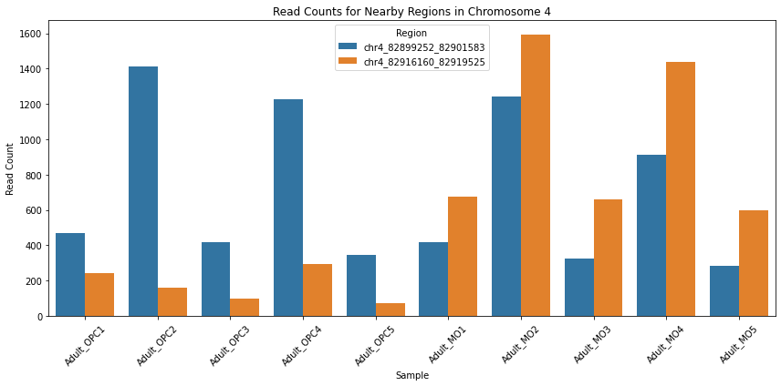

```python
import pandas as pd
import numpy as np
import seaborn as sns
import matplotlib.pyplot as plt

# Read the excel file
df = pd.read_excel("C:/Users/Tanuj/Downloads/ChIP_seq_Oligo/chip_from_paper/H3K27ac_adult.cov.table.xlsx")

# Show the first few rows
print("First few rows of the dataset:")
print(df.head())

# Basic statistics
print("\
Basic statistics of the data:")
print(df.describe())
```

    First few rows of the dataset:
      peak_coordinates_hg38  Adult_OPC1  Adult_OPC2  Adult_OPC3  Adult_OPC4  \
    0    chr1_816793_819368         438         690         272         671   
    1    chr1_826698_827752         168         344         144         515   
    2   chr1_999939_1001238          44         241         218         164   
    3  chr1_1012729_1015642         567        1332         883        1011   
    4  chr1_1019230_1020262         166         187         120         345   
    
       Adult_OPC5  Adult_MO1  Adult_MO2  Adult_MO3  Adult_MO4  Adult_MO5  
    0         214        246        385        189        444        144  
    1          98        152        252        118        380         81  
    2          84         34        122         32        130         39  
    3         557         71        132         91        173         93  
    4          87        185        206         94        325         97  
    Basic statistics of the data:
             Adult_OPC1    Adult_OPC2    Adult_OPC3    Adult_OPC4    Adult_OPC5  \
    count  69372.000000  69372.000000  69372.000000  69372.000000  69372.000000   
    mean     352.787969    593.253863    302.911982    689.580378    249.134593   
    std      678.618030   1055.592082    572.450486   1338.272132    481.777054   
    min        0.000000      0.000000      0.000000      0.000000      0.000000   
    25%       84.000000    140.000000     68.000000    151.000000     54.000000   
    50%      163.000000    301.000000    142.000000    314.000000    114.000000   
    75%      358.000000    649.000000    317.000000    719.000000    259.000000   
    max    33765.000000  51566.000000  22001.000000  57595.000000  19845.000000   
    
              Adult_MO1     Adult_MO2     Adult_MO3     Adult_MO4     Adult_MO5  
    count  69372.000000  69372.000000  69372.000000  69372.000000  69372.000000  
    mean     361.541905    609.331185    319.609684    773.095701    296.872326  
    std      984.984295   1492.461204    870.560956   2148.562569    848.750937  
    min        0.000000      0.000000      0.000000      0.000000      0.000000  
    25%       38.000000     78.000000     36.000000     77.000000     34.000000  
    50%      115.000000    221.000000    104.000000    246.000000     89.000000  
    75%      301.000000    557.000000    267.000000    647.000000    233.000000  
    max    46808.000000  57309.000000  41540.000000  97700.000000  40732.000000  
    


```python
# Filter the data for the region of interest
region_of_interest = 'chr4_82900684_82919969'
filtered_data = df[df['peak_coordinates_hg38'] == region_of_interest]

# Display the filtered data
print("Filtered data for the region of interest:")
print(filtered_data)
```

    Filtered data for the region of interest:
    Empty DataFrame
    Columns: [peak_coordinates_hg38, Adult_OPC1, Adult_OPC2, Adult_OPC3, Adult_OPC4, Adult_OPC5, Adult_MO1, Adult_MO2, Adult_MO3, Adult_MO4, Adult_MO5]
    Index: []
    


```python
# Check for any entries on Chromosome 4 to see if the region is mislabeled or nearby
chr4_data = df[df['peak_coordinates_hg38'].str.startswith('chr4')]

# Display the first few rows of Chromosome 4 data
print("Entries for Chromosome 4:")
print(chr4_data.head())

# Check the range of coordinates for Chromosome 4
chr4_data['peak_coordinates_hg38'].str.extract(r'chr4_(\d+)_(\d+)').astype(int).describe()
```

    Entries for Chromosome 4:
          peak_coordinates_hg38  Adult_OPC1  Adult_OPC2  Adult_OPC3  Adult_OPC4  \
    16978    chr4_124146_126088         437        1102         479         864   
    16979    chr4_212334_213181         123         352         137         217   
    16980    chr4_232610_233242         102         212         107          90   
    16981    chr4_241142_242649         491        1164         556        1214   
    16982    chr4_335825_338551         442        1117         514        1008   
    
           Adult_OPC5  Adult_MO1  Adult_MO2  Adult_MO3  Adult_MO4  Adult_MO5  
    16978         378        334        678        298        555        252  
    16979          99         13         73          4         22         12  
    16980          65          4         24          6         14         18  
    16981         427        149        437        170        360        143  
    16982         455        290        631        235        604        290  
    


<div>
<style scoped>
    .dataframe tbody tr th:only-of-type {
        vertical-align: middle;
    }

    .dataframe tbody tr th {
        vertical-align: top;
    }

    .dataframe thead th {
        text-align: right;
    }
</style>
<table border="1" class="dataframe">
  <thead>
    <tr style="text-align: right;">
      <th></th>
      <th>0</th>
      <th>1</th>
    </tr>
  </thead>
  <tbody>
    <tr>
      <th>count</th>
      <td>3.085000e+03</td>
      <td>3.085000e+03</td>
    </tr>
    <tr>
      <th>mean</th>
      <td>8.666611e+07</td>
      <td>8.666855e+07</td>
    </tr>
    <tr>
      <th>std</th>
      <td>5.851693e+07</td>
      <td>5.851697e+07</td>
    </tr>
    <tr>
      <th>min</th>
      <td>1.241460e+05</td>
      <td>1.260880e+05</td>
    </tr>
    <tr>
      <th>25%</th>
      <td>3.813160e+07</td>
      <td>3.813234e+07</td>
    </tr>
    <tr>
      <th>50%</th>
      <td>8.475029e+07</td>
      <td>8.475120e+07</td>
    </tr>
    <tr>
      <th>75%</th>
      <td>1.458275e+08</td>
      <td>1.458290e+08</td>
    </tr>
    <tr>
      <th>max</th>
      <td>1.897066e+08</td>
      <td>1.897082e+08</td>
    </tr>
  </tbody>
</table>
</div>


```python
# Extract start and end coordinates for Chromosome 4 and convert to numeric
chr4_data[['start', 'end']] = chr4_data['peak_coordinates_hg38'].str.extract(r'chr4_(\d+)_(\d+)').astype(int)

# Check for nearby regions within a 10,000 bp range of the region of interest
start_of_interest = 82900684
end_of_interest = 82919969

nearby_regions = chr4_data[(chr4_data['start'] <= end_of_interest) & (chr4_data['end'] >= start_of_interest)]

# Display the nearby regions
print("Nearby regions within 10,000 bp of the region of interest:")
print(nearby_regions)
```

    Nearby regions within 10,000 bp of the region of interest:
            peak_coordinates_hg38  Adult_OPC1  Adult_OPC2  Adult_OPC3  Adult_OPC4  \
    18504  chr4_82899252_82901583         470        1411         416        1229   
    18505  chr4_82916160_82919525         240         158          96         296   
    
           Adult_OPC5  Adult_MO1  Adult_MO2  Adult_MO3  Adult_MO4  Adult_MO5  \
    18504         345        415       1243        324        912        285   
    18505          73        674       1594        662       1437        597   
    
              start       end  
    18504  82899252  82901583  
    18505  82916160  82919525  
    

    C:\Users\Tanuj\AppData\Local\Temp\ipykernel_44712\1123999118.py:2: SettingWithCopyWarning: 
    A value is trying to be set on a copy of a slice from a DataFrame.
    Try using .loc[row_indexer,col_indexer] = value instead
    
    See the caveats in the documentation: https://pandas.pydata.org/pandas-docs/stable/user_guide/indexing.html#returning-a-view-versus-a-copy
      chr4_data[['start', 'end']] = chr4_data['peak_coordinates_hg38'].str.extract(r'chr4_(\d+)_(\d+)').astype(int)
    C:\Users\Tanuj\AppData\Local\Temp\ipykernel_44712\1123999118.py:2: SettingWithCopyWarning: 
    A value is trying to be set on a copy of a slice from a DataFrame.
    Try using .loc[row_indexer,col_indexer] = value instead
    
    See the caveats in the documentation: https://pandas.pydata.org/pandas-docs/stable/user_guide/indexing.html#returning-a-view-versus-a-copy
      chr4_data[['start', 'end']] = chr4_data['peak_coordinates_hg38'].str.extract(r'chr4_(\d+)_(\d+)').astype(int)
    


```python
# Visualize the read counts for the nearby regions
plt.figure(figsize=(12, 6))

# Melt the data for easier plotting
melted_data = nearby_regions.melt(
    id_vars=['peak_coordinates_hg38'], 
    value_vars=['Adult_OPC1', 'Adult_OPC2', 'Adult_OPC3', 'Adult_OPC4', 'Adult_OPC5', 
                'Adult_MO1', 'Adult_MO2', 'Adult_MO3', 'Adult_MO4', 'Adult_MO5'],
    var_name='Sample', 
    value_name='Read Count'
)

# Plot using seaborn
sns.barplot(data=melted_data, x='Sample', y='Read Count', hue='peak_coordinates_hg38')
plt.title('Read Counts for Nearby Regions in Chromosome 4')
plt.xticks(rotation=45)
plt.ylabel('Read Count')
plt.xlabel('Sample')
plt.legend(title='Region')
plt.tight_layout()
plt.show()
```


    

    


```python

```
